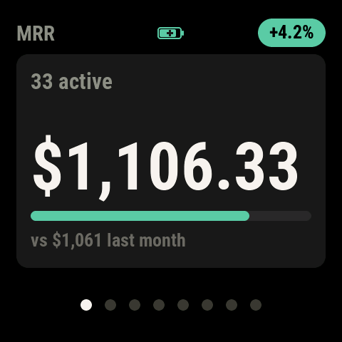
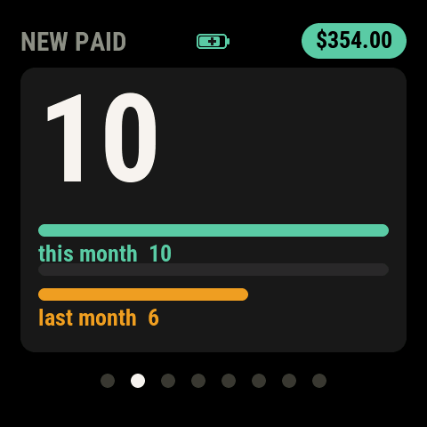
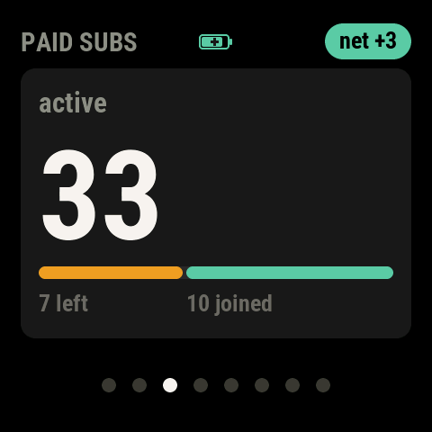
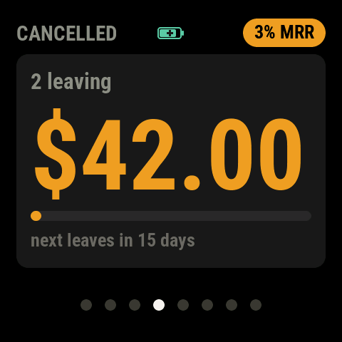
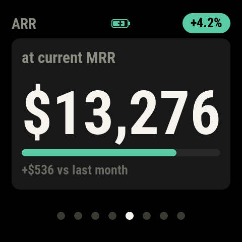
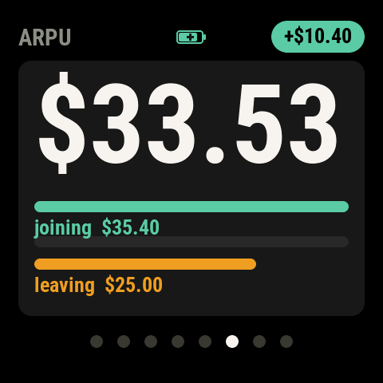
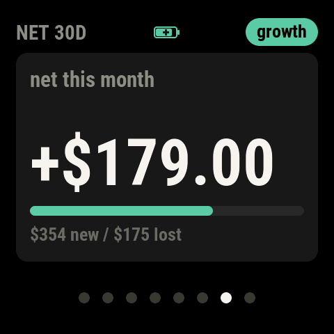
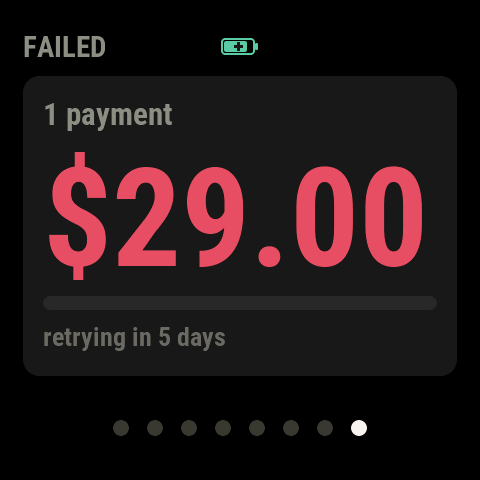
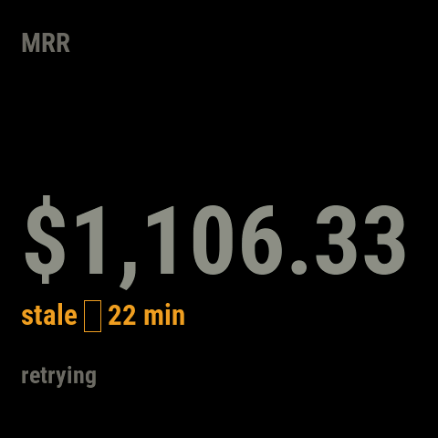
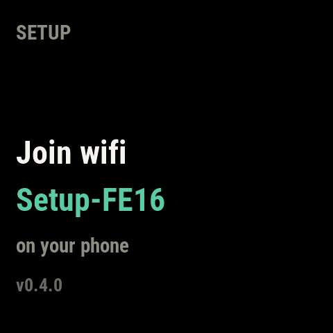

# Stripe Revenue Display

A small instrument that sits on your desk and shows your live Stripe
revenue.



It cycles through eight screens, five seconds each, in numbers you can read
from across the room:

**What you are making.** Monthly recurring revenue with a 30-day trend line,
the same figure as an annual run rate, and the average revenue per
subscriber.

**Who is arriving and who is leaving.** New paid signups and whether they are
speeding up or slowing down. The subscribers you gained against the ones you
lost. Revenue that has given notice but has not left yet.

**What the month actually did.** The net effect on revenue over 30 days, so
growth and churn land as one number instead of two you have to reconcile.

**What needs you today.** Failed payments, with what they are worth and when
Stripe next retries them.

No app, no dashboard, no browser tab you forget to open. It talks to the
Stripe API and to nothing else.

There is no soldering and no enclosure to print. You buy one board, flash it
over USB, and finish the setup on your phone. If you have never written
firmware before, that is fine, because this page assumes you have not.

## What it shows

Eight screens, five seconds each. Tap the panel or press a button to move
forward; a screen with nothing to say hides itself, so a young account sees a
shorter loop than a mature one.

| | | |
|:--:|:--:|:--:|
|  |  |  |
| **MRR**: monthly recurring revenue, with its 30-day trend | **NEW PAID**: signups, and whether they are speeding up | **PAID SUBS**: the flow behind the count |
|  |  |  |
| **CANCELLED**: revenue that gave notice but has not left yet | **ARR**: the annual figure, in annual units | **ARPU**: are the customers you win worth more than the ones you lose |
|  |  |  |
| **NET 30D**: what the month did to revenue | **FAILED**: payments that need a nudge | **stale**: what it shows instead of a number it cannot vouch for |

The last tile is not a screen but a state. If a fetch fails, the deck says so
rather than leaving an old figure up looking current.

These images are not mockups. They are rendered from the firmware itself, at
the panel's real 480x480 with the real fonts, so they cannot drift from what
the device draws.

## What you need

**One board: the [Waveshare ESP32-C6-Touch-AMOLED-2.16](https://www.waveshare.com/esp32-c6-touch-amoled-2.16.htm).**
A 2.16-inch 480x480 AMOLED with a touch layer, a USB-C port and an on-board
power controller, all on one piece. Nothing is soldered and no enclosure is
needed, because the board is the device.

Waveshare sells it in a few configurations. This was built on the **board
with the battery**, which lets it sit on a shelf untethered and is what the
battery indicator in the corner reports. The board works the same on USB
power alone, so the battery is optional. Add it if you want the device to
survive being unplugged.

**A USB-C cable** that carries data, not just power.

**A Stripe account** with at least one active subscription. The device reads
recurring revenue, so a one-off-payments account will show zeroes.

**A computer** with Python 3 to run the flashing tool, on macOS, Linux or
Windows.

## Setting one up

### 1. Install PlatformIO

Flashing needs [PlatformIO](https://platformio.org/install/cli), which is
what compiles the firmware and copies it to the board:

```sh
pip install platformio
```

Check it worked:

```sh
pio --version
```

### 2. Create a Stripe restricted key

In the Stripe dashboard, go to **Developers → API keys → Create restricted
key**. Give it a name, then grant **Read** on exactly two resources:

- **Subscriptions**
- **Invoices**

Leave everything else at *None*. The key will start with `rk_`.

A key limited to those two read permissions cannot move money, refund
anyone, or change a subscription. It can reveal your subscriber count and
revenue, which is the whole point of the device.

Keep the key on screen or paste it somewhere you can reach from your phone.
You will need it in step 5, and Stripe only shows it once.

### 3. Flash the board

Plug the board into your computer, then:

```sh
git clone https://github.com/cosjef/stripe-desk-display.git
cd stripe-desk-display/firmware-c6
pio run -t upload
```

The first build downloads the toolchain and takes a few minutes. Later ones
take about twenty seconds.

If upload cannot find the board, name the port explicitly:

```sh
ls /dev/cu.usbmodem*            # macOS
pio run -t upload --upload-port /dev/cu.usbmodem21101
```

No credentials go in at build time. There is nothing to edit before you
flash, and no secret ends up in the binary.

### 4. Join the setup network

When the board comes up with nothing stored, it starts its own WiFi network
and shows the name on the panel:



On your phone, join that open network, named `Setup-` followed by four
characters from the board's ID. A setup page should open by itself. If it does not,
browse to **http://192.168.4.1/**.

### 5. Give it your WiFi and your key

The page asks for your home WiFi first. The device joins your network, then
comes back and asks for the Stripe key from step 2.

Paste the key and submit. It is checked against the live Stripe API before it
is saved, so a wrong key fails while you are still holding the phone rather
than leaving you with a dead panel.

When it succeeds the deck appears, and setup is done. Both the WiFi
credentials and the key are stored on the board and survive a reflash, so
this is a one-time step.

## Living with it

**It polls every five minutes.** Fresh enough to feel live, gentle enough on
the API.

**Two screens need history before they say anything.** The MRR trend line
needs seven daily samples, and the ARPU comparison needs six customers on
each side before it will call one group better than the other. Until then
those screens show the figure without the comparison. That is deliberate: the
device would rather show less than guess.

**Colour means something specific.** Green is a realized gain and nothing
else. Amber is a degraded state. Red is a threshold worth acting on, and the
FAILED screen is the only one that earns it.

**It keeps the last good numbers.** If WiFi drops or Stripe is unreachable,
the deck marks itself stale instead of blanking or lying.

## Troubleshooting

**The panel is black right after flashing.** Give it a few seconds. The
board brings up its own display power rails before the first draw, so there
is a pause between the upload finishing and anything appearing.

**No `Setup-` network appears.** The board only starts one when it has no
stored credentials. If you have set it up before, erase its memory to start
over:

```sh
esptool --port /dev/cu.usbmodem21101 erase-region 0x9000 0x5000
```

**The setup page does not open when I join the network.** Browse to
**http://192.168.4.1/** directly. Some phones suppress the automatic popup.

**"Stripe key rejected."** The key was reachable but Stripe refused it.
Check it starts with `rk_`, was copied whole, and has Read on Subscriptions
and Invoices.

**"Could not reach Stripe."** A network problem rather than a key problem.
The device retries by itself every thirty seconds until the first fetch
succeeds, so this often clears without help.

**Screens are missing from the rotation.** That is intended. A screen with
nothing to report hides itself, so no failed payments means no FAILED screen.

**`pio: command not found`.** PlatformIO is not on your PATH. Open a new
terminal after installing, then run `pio --version` again.

## The numbers are yours

The device reads your Stripe account and sends the data nowhere else. There
is no telemetry, no analytics, and no server belonging to this project.

Two things worth knowing before you set one up in a busy place: the setup
network is open and the key page is plain HTTP, so during those few minutes
someone in radio range could capture your WiFi password and the Stripe key.
Once setup finishes, all Stripe traffic runs over TLS against a pinned
certificate. The stored key is unencrypted on the board, which is a
deliberate trade, because a read-only restricted key leaks a subscriber
count, not the ability to move money.

## For developers

The repository splits in two:

```
core/           portable: rendering, MRR maths, parsers, fonts, tests
firmware-c6/    the device: display, radios, provisioning, I2C peripherals
docs/           the spec, the port plan, and the hardware notes
```

Nothing in `core/` may include `esp_*.h`, `<Arduino.h>`, `driver/*` or
`freertos/*`. That single constraint is what lets 1,518 checks run on a
laptop with no hardware and no SDK.

### Tests

```sh
cd core/test
make
for t in ./test_*; do [ -x "$t" ] && $t; done
```

1,518 checks across 26 suites: text measurement, hero auto-sizing, MRR
arithmetic, the streaming JSON scanners, rotation rules, freshness, battery
thresholds, refresh scheduling. One boots real LVGL against an offscreen
framebuffer and asserts on actual pixels.

`make quick` skips the LVGL build. LVGL comes from the PlatformIO
dependency: `cd firmware-c6 && pio pkg install`.

Panel bring-up, the radios and the I2C peripherals are not covered. They
need real hardware, and every claim about them in the docs was checked
against a register read rather than a datasheet.

### Regenerating the screenshots

The images on this page come from the firmware, not a drawing tool. After any
layout change:

```sh
cd core/test && make render_docs && ./render_docs
../../docs/img/build.sh          # needs ImageMagick
```

### Regenerating fonts

```sh
cd core/tools
./gen_fonts.sh            # needs npx (lv_font_conv)
```

If you change the face or weight you **must** also regenerate the glyph
advance table in `core/src/hero_size.c`:

```sh
./dump_advances.py        # needs Pillow
```

Otherwise text sizing will silently disagree with what LVGL renders.

### Hardware notes

Pin assignments are in [firmware-c6/src/board.h](firmware-c6/src/board.h).
Several contradict Waveshare's own example (`LCD_CS` is GPIO15, not the 5
their ESP-IDF sample documents), and
[docs/C6-HANDOFF.md](docs/C6-HANDOFF.md) records how each was established,
along with an earlier ESP-IDF attempt that never drove the panel past its
opening frame.

### Known limitations

- **The timezone is hardcoded** to `EST5EDT` in `firmware-c6/src/main.cpp`.
  It decides when the daily history rolls over, so outside US Eastern the day
  boundary lands at the wrong hour. Change `DEVICE_TZ` before flashing.
- **NVS is unencrypted**, and **provisioning is unencrypted**. Both are
  covered under "The numbers are yours" above.

[docs/firmware-build-plan.md](docs/firmware-build-plan.md) has the full list
and what is deliberately not built.

### Deviations from the spec

Findings from real hardware that contradict
[the written spec](docs/stripe-revenue-display-spec.md):

1. **Background is `#000000`, not `#121211` (spec 4.1/3.1).** Inherited from
   an IPS panel where `0x04`-`0x30` collapsed to the same mid-gray.
   Unverified on this AMOLED, where the reasoning does not carry over. A
   black pixel here is simply off, so the spec's `#121211` may well be
   viable. Measure before changing it.

2. **Typeface is Roboto Condensed, not monospace (spec 5.4).** Monospace
   spends a full character cell on `.`, shrinking digits enough to hurt
   legibility at 50cm. Roboto Condensed has tabular figures, so it keeps the
   anti-jitter property that motivated the monospace rule anyway.

3. **Streaming JSON is kept, but not for the reason the spec gives (spec
   8.3).** Measured with TLS open: 155KB free and a 131KB largest block,
   where buffer-then-parse fits. It is kept because it is O(1) in account
   size, not because it is required.

## License

MIT. See [LICENSE](LICENSE).

Roboto Condensed is vendored under the SIL Open Font License; see
[core/tools/fonts/LICENSE-RobotoCondensed.txt](core/tools/fonts/LICENSE-RobotoCondensed.txt).
The generated font files in `core/fonts/` are derived from it and carry the
same terms.

Not affiliated with Stripe. "Stripe" is their trademark; this project only
reads their public API.
